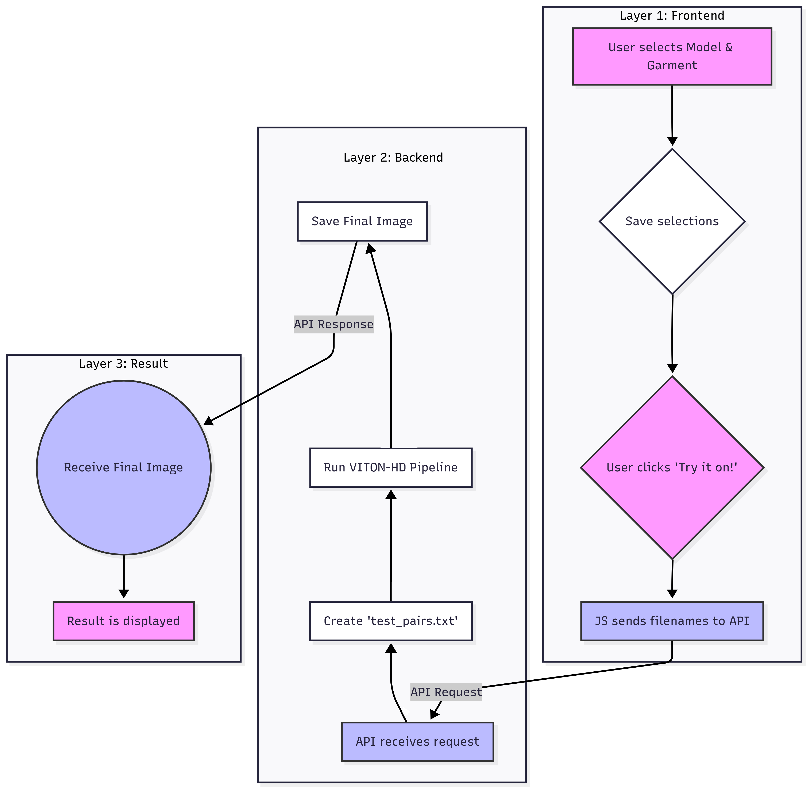

# 👔 VirtualFIT: Full-Stack AI Virtual Try-On Platform

**A production-ready implementation of High-Resolution Virtual Try-On (VITON-HD) featuring a React frontend, distributed Hybrid-Cloud architecture, and automated computer vision pipelines.**

[](./frontend)
[](./backend_proxy)
[](./colab_runtime)
[](./colab_runtime)
[](./Project_Report.pdf)

> **The Problem:** State-of-the-art virtual try-on models require massive GPUs (VRAM > 12GB), making them inaccessible for standard web applications.
>
> **The Solution:** VirtualFIT implements a **Proxy-Tunnel Architecture** that decouples the UI from the inference engine. It allows a lightweight React client to control a remote Tesla T4 GPU node, delivering photorealistic 1024x768 try-on results in <4 seconds.

---

## 👨‍🔬 Authors

- **Ahsan Rizvi**  
- **Umme Hani Roshni**
- **Sirajum Munira** 
- **Md. Irtiza Hossain Mahmud**
  
Department of Electrical and Computer Engineering, North South University

---

## 🏗️ System Architecture

The system implements a **Proxy-Tunnel Microservices Pattern** to bypass local hardware limitations.



```mermaid
graph TD
    subgraph Client_Layer [Client Side]
        User((User)) -->|1. Selects Model & Cloth| React[React Frontend<br/>(localhost:3000)]
        React -->|2. Multipart Image Upload| Proxy[FastAPI Proxy Server<br/>(localhost:8000)]
    end

    subgraph Tunneling_Layer [Security & Networking]
        Proxy -->|3. Forward Request| Ngrok_Client[Ngrok Secure Tunnel]
        Ngrok_Client <==>|4. Encrypted Stream| Ngrok_Cloud((Ngrok Cloud))
    end

    subgraph Cloud_Layer [Inference Node - Google Colab]
        Ngrok_Cloud <==>|5. Ingress Traffic| Colab_Server[Colab GPU Runtime]
        
        Colab_Server -->|6. Orchestrate| Inference[Inference Script (test.py)]
        
        subgraph VITON_HD_Pipeline [PyTorch GAN Pipeline]
            Inference --> Seg[SegGenerator<br/>(Body Parsing)]
            Inference --> GMM[GMM<br/>(Geometric Warping)]
            Inference --> ALIAS[ALIASGenerator<br/>(Texture Synthesis)]
        end
    end

    ALIAS -->|7. Return Synthesized Image| Colab_Server
    Colab_Server -->|8. Stream Response| React
    
    style Client_Layer fill:#e3f2fd,stroke:#2196f3,stroke-width:2px
    style Cloud_Layer fill:#fbe9e7,stroke:#ff5722,stroke-width:2px
    style VITON_HD_Pipeline fill:#fff3e0,stroke:#ff9800,stroke-dasharray: 5 5

```

### Data Flow Lifecycle

1. **Client Layer (React):** The user captures a photo or selects a model. The app serializes the state to `localStorage` and posts a `Multipart/Form-Data` request to the Local Proxy.
2. **Proxy Layer (FastAPI):** The local server receives the binary payload, validates file types, and forwards the request via **HTTPX** through the secure tunnel.
3. **Inference Layer (Colab GPU):**
* **Ingestion:** The cloud node receives images and triggers the `subprocess`.
* **Segmentation:** `SegGenerator` predicts the human body parsing map.
* **Warping:** `GMM` (Geometric Matching Module) applies Thin-Plate Spline transformations to align the cloth with the pose.
* **Synthesis:** `ALIASGenerator` fuses the warped cloth with the person using misalignment-aware normalization.


4. **Response:** The synthesized image is streamed back through the tunnel to the client for rendering.

---

## 🚀 Key Engineering Contributions

This project transforms the academic **VITON-HD** research code into a deployed, user-centric product. Major engineering contributions include:

### 1. Hybrid-Cloud Microservices

Instead of a monolithic script, the system is split into three decoupled layers:

* **Inference Node (Cloud):** A modified `test.py` script running on **Google Colab (Tesla T4)** that handles the heavy PyTorch/GAN pipeline.
* **Gateway Layer (Local):** A **FastAPI** proxy server that sanitizes inputs, handles CORS, and manages the long-polling lifecycle of requests.
* **Tunneling Strategy:** Automated the connection between the local localhost and the ephemeral cloud instance using **Ngrok**, allowing secure public access to the isolated GPU runtime.

### 2. Intelligent Computer Vision Pipelines

To eliminate the need for manual data entry, two custom R&D pipelines were engineered:

* **Automated Cataloging:** An unsupervised learning script (`cloth_analzyer.ipynb`) utilizes **K-Means Clustering** to scan raw clothing pixels, extract dominant centroids, and auto-tag items (e.g., "Navy", "Crimson") for the filtering UI.
* **Skin-Tone Matching Engine:** A computer vision module (`skin_tone_analzyer.ipynb`) that uses **Haar Cascade** face detection and **LAB Color Space** analysis to calculate the *Individual Typology Angle (ITA)*, enabling the app to recommend models that match the user's skin tone.

### 3. Dynamic "Frankenstein" Prevention

A common failure mode in GANs is resolution mismatch (the "Frankenstein effect").

* I engineered a strict **ETL (Extract, Transform, Load)** pipeline that pre-validates all assets.
* The frontend does not hardcode images; it dynamically renders the catalog from a generated `metadata.json` database, ensuring that only pre-processed, resolution-matched assets are sent to the model.

---

## 📂 Repository Structure

| Directory | Description |
| --- | --- |
| **`/backend_proxy`** | **FastAPI Local Server.** Handles image uploads, CORS, and request forwarding to the cloud. |
| **`/frontend`** | **React Application.** Features `framer-motion` animations, `webcam` integration, and dynamic JSON catalog rendering. |
| **`/colab_runtime`** | **Cloud Scripts.** Includes the `Final_backend_server.ipynb` orchestrator and modified VITON-HD inference scripts (`test.py`). |
| **`/data_tools`** | **Jupyter Notebooks.** R&D scripts for skin tone analysis and automated metadata tagging. |
| **`Project_Report.pdf`** | **Full Documentation.** The complete academic report detailing methodology, LPIPS metrics, and user testing results. |

---

## 📦 Installation & Setup Guide

### Phase 1: The Cloud Brain (Google Colab)

*This step starts the GPU server.*

1. Upload the contents of `/colab_runtime` to a folder in your Google Drive.
2. Open `Final_backend_server.ipynb` in Google Colab.
3. **Run All Cells.** This will clone the VITON-HD repo, install dependencies, and start the Ngrok tunnel.
4. **Copy the Public URL** generated at the bottom (e.g., `https://a1b2.ngrok-free.app`).

### Phase 2: The Local Proxy

*This step bridges your PC to the Cloud.*

1. Navigate to `/backend_proxy`.
2. Install requirements: `pip install -r requirements.txt`.
3. Open `main.py` and paste your Ngrok URL into the `COLAB_BACKEND_URL` variable.
4. Run the server: `python main.py`.

### Phase 3: The Frontend

*This step launches the UI.*

1. Navigate to `/frontend`.
2. Install dependencies: `npm install`.
3. Launch the app: `npm start`.
4. Open `http://localhost:3000` in your browser.

---

## ⚠️ Attribution & Research Credits

This project is an advanced implementation based on the foundational research and model architecture provided by the **VITON-HD** team.

* **Original Paper:** *VITON-HD: High-Resolution Virtual Try-On via Misalignment-Aware Normalization* (CVPR 2021)
* **Original Authors:** Seunghwan Choi, Sunghyun Park, Minsoo Lee, Jaegul Choo (KAIST).
* **Base Repository:** [shadow2496/VITON-HD](https://github.com/shadow2496/VITON-HD)

**Note on Modifications:**
While the core GAN model and inference logic are derived from VITON-HD, the **Full-Stack Architecture**, **FastAPI/React Implementation**, and **Automated Data Pipelines** (`data_tools/`) are original contributions by **Ahsan Rizvi**.

---

## 📜 License

This repository is released under the **CC BY-NC 4.0** (Creative Commons Attribution-NonCommercial 4.0) license to align with the original VITON-HD distribution terms.

**You are free to:**
* **Share** — copy and redistribute the material in any medium or format.
* **Adapt** — remix, transform, and build upon the material.

**Under the following terms:**
1.  **Attribution:** You must give appropriate credit to **Ahsan Rizvi** for the full-stack implementation and the **VITON-HD Authors** for the core model architecture.
2.  **Non-Commercial:** You may **not** use this material for commercial purposes (e.g., selling a paid service).

> **Citation (for this repository):**
> **Rizvi, A. (2025). *VirtualFIT: A Hybrid-Cloud Virtual Try-On Platform*. GitHub Repository.**
